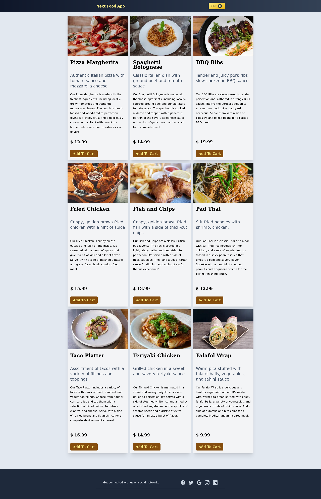
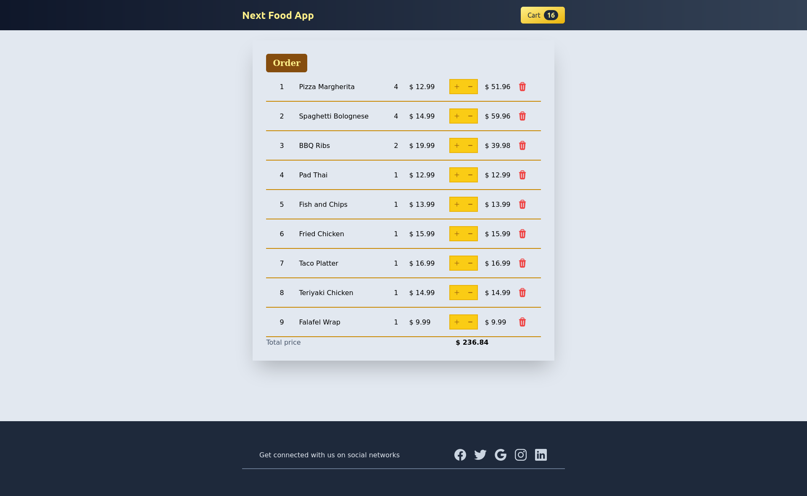
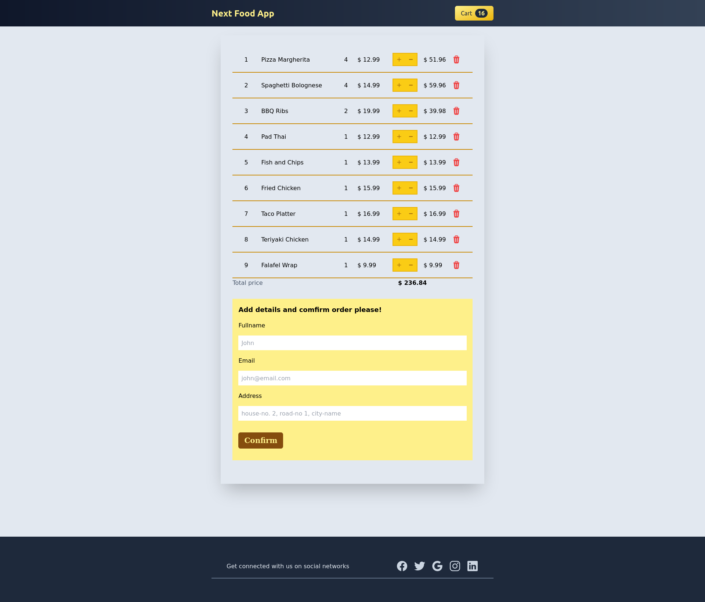

# 1. Next Food App

Full-Stack App with robust backend to take order from user and deliver smooth user experience with slick frontend.

---

## Preview images:

 

### Food Items Home Page:

 

- Order as may items as you want from here.
- Orders will be added to the cart automatically.

 

### Food Cart Page:

 

- Once you click Cart button on the top right corner, You will be routed to the cart preview page.
- Where user can add more items to the cart, remove item
  from the cart or delete item from the cart.
- All the changes will be saved and updated in the cart in real time.

 

### Food Order Confirm Page:

 

- After placing order information and confirming order, order details will be saved in the Mongo Db database.
- On successful order attempt a notification will be shown
  to the user as confirmation of order placement.

---

## Tech Stack Used:

  
  

  
  
  

---

## Link of deployed app:

TBA

---

## Profiles:
